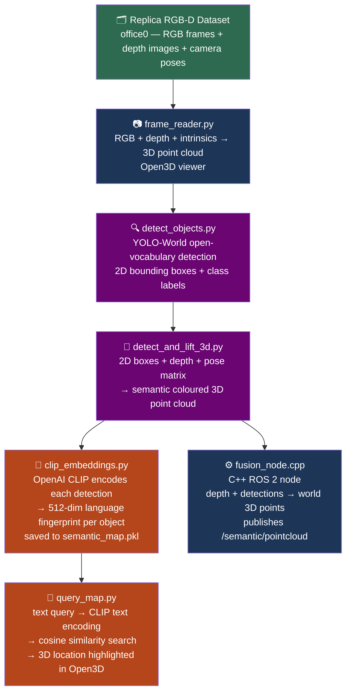

# SemanticBot 🤖
> Open-vocabulary semantic 3D mapping for indoor robots — find any object with natural language

[](https://docs.ros.org/en/humble/)
[](https://python.org)
[](https://isocpp.org)
[](LICENSE)

---

## The problem

Indoor robots can navigate and avoid obstacles but they are semantically blind. They know where things are geometrically but have no idea what those things are. Ask a robot to find the wheelchair and it cannot — it only sees distances, not meaning. SemanticBot bridges that gap.

---

## What it does

SemanticBot builds a queryable semantic 3D map of an indoor environment. Every point in the map carries a class label, a CLIP language fingerprint, and a real 3D world position. Query the map in plain English and get a 3D location back — no retraining, no hardcoded labels, any object, any description.

---

## Architecture
## Architecture



---

## Tech stack

| Component | Technology |
|-----------|------------|
| Robot middleware | ROS 2 Humble |
| Object detection | YOLO-World (open-vocabulary) |
| Vision-language model | OpenAI CLIP (ViT-B/32) |
| 3D processing | Open3D |
| Neural network framework | PyTorch 2.2 + Apple MPS |
| C++ perception node | rclcpp, sensor_msgs, vision_msgs |
| Dataset | Replica (Meta Reality Labs) |
| Environment | Docker + Ubuntu 22.04 |

---

## Results

- 688 objects detected and stored across one indoor office scene
- Natural language queries work for both direct and indirect descriptions
- C++ ROS 2 fusion node publishes semantic point clouds on /semantic/pointcloud
- Runs on Apple M2 Pro with MPS GPU acceleration — no NVIDIA GPU required

---

## How to run

```bash
# Clone the repo
git clone https://github.com/Samarthraman01/Semanticbot.git
cd Semanticbot

# Create conda environment
conda create -n semanticbot python=3.11 -y
conda activate semanticbot
pip install open3d torch torchvision ultralytics

# Build semantic map
python3 scripts/clip_embeddings.py

# Query with natural language
python3 scripts/query_map.py

# Run C++ ROS 2 fusion node (requires Docker)
docker run -it --rm -v $(pwd):/workspace ros:humble bash
source /opt/ros/humble/setup.bash
cd /workspace/ros2_ws && colcon build
ros2 run semantic_fusion fusion_node
```

---

## Author

**Samarth Raman Ghanate**
M.Sc. Electromobility Engineering — FAU Erlangen-Nürnberg
Research Assistant — Siemens Healthineers

[LinkedIn](https://linkedin.com/in/yourprofile) · [GitHub](https://github.com/Samarthraman01)